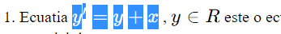
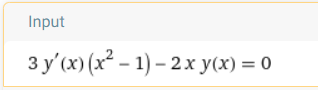
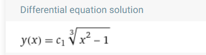
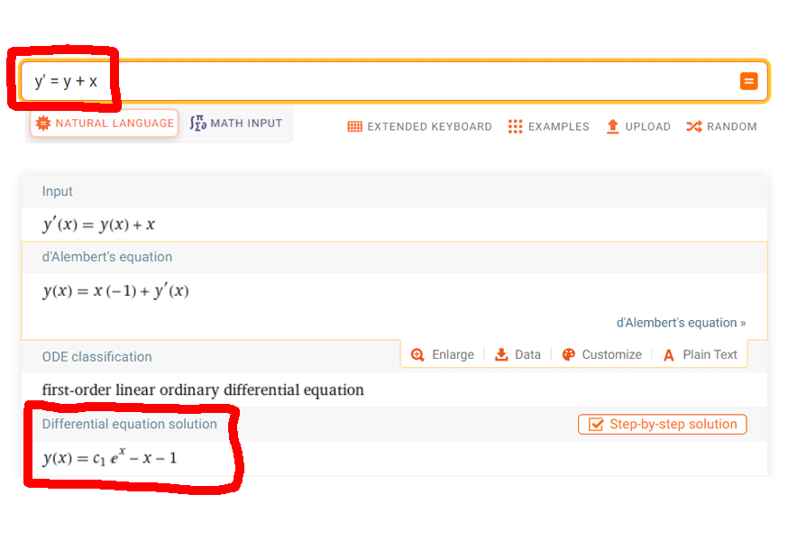
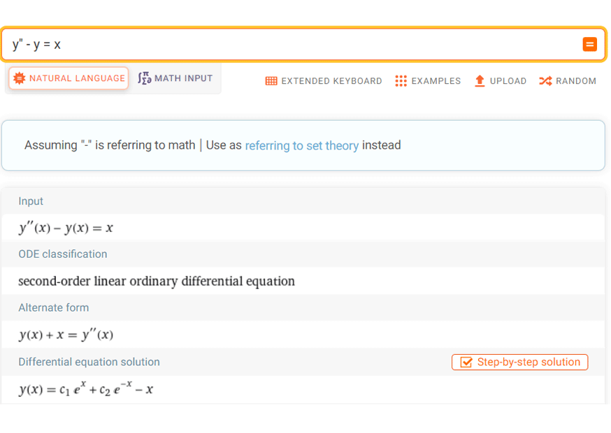
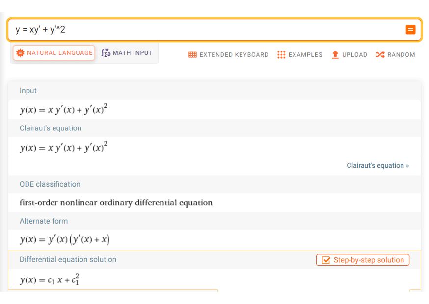
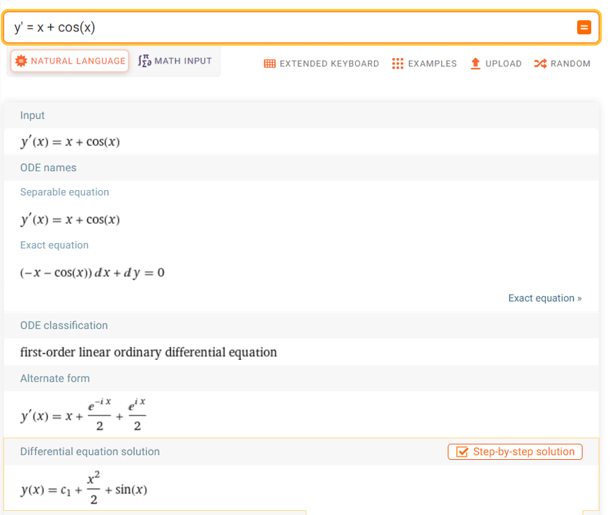
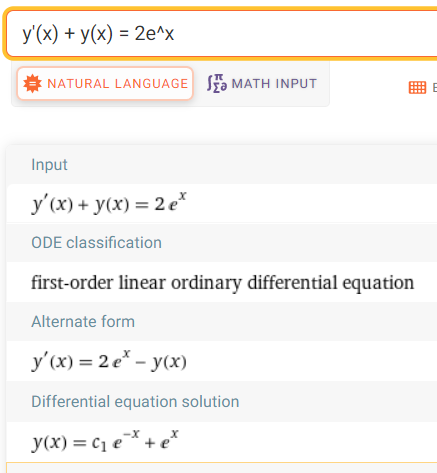
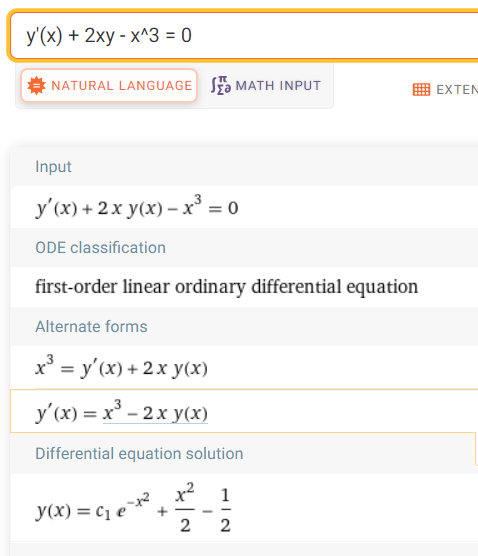

# Ecuatii diferentiale si sisteme dinamice
### UTM - Informatica ID an2 
## Exercitii

1. **Click** pe ecuatia de rezolvat apoi **copy**;
- 
2. Mergi pe https://www.wolframalpha.com/ , **paste** , sterge primul si ultimul **" $ "**;
- 
3. Unele ecuatii trebuie scrise explicit in wolfram. Ex: $ 3y'(x^2 - 1) - 2xy = 0 $ \ trebuie scrisa in wolfram ca **`3y'(x)(x^2 -1) - 2xy(x) = 0`**, adica func **y'(x)** si **y(x)** in loc de var **y**; nu merge scrisa **`3y'(x^2 - 1) - 2xy = 0`**:
-  

### Exercitii
1. Ecuatia $ y' = y + x $ , $ y \in R $ este o ecuatie diferentiala de ordinul
   I. O solutia a sa este $$ y = e^x - x - 1 $$ , $ x \in R $ . Functia $ y(x) = Ce^x -
   x - 1 $ , unde C este o constanta arbitrara reprezinta o familie de solutii
   ale ecuatiei date.
   

2. Ecuatia $ y'' - y = x $ , $ x \in R $ este o ecuatie diferentiala de ordinul
   II. Functia $$ y = C_1e^x + C_2e^{-x} - x $$ , $ x \in R $ , cu $ C_1, C_2 $
   constante arbitrare, reprezinta o familie de solutii ale ecuatiei date. Dand
   valori particulare lui $ C_1 $ si $ C_2 $ , se obtin solutii particulare.
  C_1,C_2 \in R $ constante arbitrare. \
  Sa se determine solutia problemei Cauchy, care pentru
  $ x = 0 $ indeplineste conditiile: \
  $ y(0) = 1, y'(0) = 0 $ (Adica pleaca dintru-un pct (0,1) si pleaca cu viteza 0 
  = derivata). Calculam y(0), ... \
  $ y(0) = 1 $ ; 
  $ y'(0) = C_1 - C_2 - 1 $ ;
  $ => C_1 + C_2 = 1 $ ;
  $ => C_1 - C_2 = 1 $ ;
  $ => 2C_1 = 2 => C_1 = 1 $ ;
  $ C_2 = 1 - C_1 = 0 $ ;
  $ => y = e^x - x $ ; aceasta se numeste solutia problemei Cauchy.
  

3. Fie ecuatia $ y = xy' + y'^2 $ ecuatie diferentiala de ordinul 1, neliniara (
   y' la puterea a 2 a => functie parabolica != liniara) are ca **solutie
   generala** familia dreptelor
   $$ y = Cx + C^2 $$ , $ x \in R $ , C = constanta
   arbitrara . Dpdv geometric solutia generala reprezinta o familie de drepte (
   y = mx + n). Ecuatia admite si solutia (functia) $ y = -\frac 1 4 x^2, x \in
   R $ (geometric este ecuatia unei parabole) si nu se obtine dintr-o valoare a
   lui C, fiind, deci, o **solutie singulara** a ecuatiei.
   

4.  Sa se gaseasca solutia ecuatiei diferentiale $ y' = x + cos(x) $ , care
trece prin punctul $(0,2)$. Cautam sol gen a ecuatiei. Ecuatia este de
ordinul 1. Solutia generala ( $ y = \int f(x) dx + C $
):
$ y = \int f(x)dx + C $ ;
$ y = \int(x + cos(x))dx + C $ ;
$ y = \frac{1}2t^2 \int_0^x + sin(t)\int_0^x +  C $ ;
$ y = \frac 1 2 x^2 \int_0^x + sin(x)\int_0^x +  C $ ;
$ y = \frac{x^2}2 + sin(x) + C $ ;
Pentru
$ x_0 = 0 $ =>
$ y(0) = C $ , $ C = 2 $ ,
$ y(0) = 2 = 0 + \frac{0^2}2 + C $ =>
$$ y = \frac{x^2}2 + sin(x) + 2 $$ este solutia problemei Cauchy, care pentru
$ x = 0 $ ia valoarea $2$ ( $ y(0) = 2 $ ), sau este din planul $xOy$ care trece prin
punctul $(0, 2)$ .
Multimea solutiilor unei ecuatii diferentiale de ordinul I depinde de o constanta arbitrara. Se poate arata si invers, ca orice familie de plane 
$(3^o) \varphi(x, y, C) = 0, (x,y) \in D $ cu $\varphi$ continua si derivabila partial in D 
in raport cu x si y, verifica o ecuatie diferentiala de ordinul I. Intr-adevar derivam partial in raport cu x:
$ \frac{\delta \varphi}{\delta x} + \frac{\delta \varphi}{\delta y} = 0 $ .
Eliminand pe C intre aceasta relatie si $(3^o)$ rezulta
$ \Phi(x, y, y') = 0 $ , deci o ecuatie diferentiala de ordinul I.

5. Sa se determine ecuatia diferentiala verificata de familia de curbe 
$ y = x^n + Cx + 1 $ , $ x \in R $ . \
Derivam in raport cu x => 
$$ y' = nx^{n-1} + C $$ => $ C = y' - nx^{n-1} $ . \
Inlocuim in relatia data: \
$ y = x^n + x(y' - nx^{n-1}) + 1 $ \
$ y = xy' + (1 -n)x^n + 1 $

6. Fie ecuatia $ y = xy' + y'^2 $ o ecuatie diferentiala de ordinul 1, neliniara
(pentru ca $y'$ e la puterea a doua => functie parabolica != liniara).
Solutia generala a sa este data de $$ y = Cx + C^2 $$ , C = constanta
arbitrara. Dpdv geometric solutia generala este o familie de drepte $
(dreapta: y = mx + n) $ . Dar si $ y = -\frac{1}{4}x^2, x \in R $ este
solutie a ecuatiei $ y = Cx + C^2 $ $ y' = C $ 
$ Cx + C^2 = Cx + (C)^2 $ ... se verifica pentru $ \forall x \in R $  => \
$ y = Cx + C^2 $ este solutie generala a ecuatiei.
$ y = - \frac{1}4 x^2, x \in R $ ;
$ y' = -\frac{2}4 x $ ;
$ y' = -\frac{1}2 x $ ;
$ y = xy' + y'^2 $ ;
$ -\frac{1}4 x^2 =? x(-\frac{1}{2}x) + (-\frac{1}{2}x)^2 $ ;
$ -\frac{1}{4}x^2 = -\frac{x^2}{2} + \frac{x^2}4 $ ;
$ -\frac{x^2}4 = -\frac{2x^2}4 + \frac{x^3}4 $ ;
$ -\frac{x^2}4 = -\frac{x^2}4 $ <=> ecuatia este verificata de \
$ y = -\frac{x^2}4 $ pentru $ x \in R $ => 
Functia
$ y = -\frac{x^2}4 $ (geometric este ecuatia unei parabole) este de asemenea solutie a ec. \
Verificare: 
$ y' = -\frac{2x}4 $ ; 
$ y' = -\frac{x}4 $ ;
$ xy' + y'^2 = x(-\frac{x}2) + (-\frac{x}2)^2 $ ; \
D.p.v. geometric, solutia reprezinta o parabola; expresia sa nu se poate ... 
din solutia generala
$ y = Cx + C^2 $ (familia de drepte) pentu nici o valoare posibila a constantei C. =>
(Putem sa dam o valoare lui C a.i. o parabola sa devina o dreapta? **NU**. Dar se poate sa-i dam ca valoare o ecuatie).
$ y = -\frac{x^2}4 $ este solutie singulara a ecuatiei.

7. Sa se determine solutia problemei Cauchy pentru ecuatia diferentiale de ordinul II,
cu conditiile Cauchy precizate:
$ y'' - y = x $ , $ x \in R $ \
$ y_0 = 0 => 
\begin{cases}
y(0) = 0 \cr
y'(0) = 1
\end{cases}
$, \
$ x_0 = 0 $ . \
Solutia generala a ecuatiei: \
$ y = C_1e^x + C_2e^{-x} - x $ ; $C_1$ si $C_2$ sunt constante arbitrare.
S-a verificat ca $y$ este solutia generala a ecuatiei, 
$ \forall x \in R $ . \
Aplicam conditiile initiale: \
$
\begin{cases}
  y(0) = 0 \cr
  y'(0) = 1
\end{cases}
$ 
$
\begin{cases}
  y(x) = C_1 e^x + C_2e^{-x} - x \cr
  y'(x) = C_1e^x + C_2e^{-x} - 1 
\end{cases}
$  \
$
\begin{cases}
  y(0) = C_1 + C_2 = 0 \cr
  y'(0) = C_1 - C_2 - 1 = 1
\end{cases}
$
$
\begin{cases}
  C_1 + C_2 = 0 \cr
  C_1 - C_2 - 1 = 1
\end{cases}
$ => \
$ 2C_1 = 2 => C_1 = 1 $ \
$ C_2 = -C_1; C_2 = -1 $ \
=>
$ y = e^x - e^{-x} - x $ este solutia problemai Cauchy. \
$
\begin{cases}
  y(0) = 1 - 1 = 0 \cr
  y'(0) = 1 + 1 - 1 = 1
\end{cases}
$ .

8. Se cere solutia generala a ecuatiei: $ (sin(y) - \frac{2y}{x^3})dx + (x cos(y) + \frac{1}{x^3})dy = 0 $ \
$ P(x, y) = sin(y) - \frac{2y}{x^3}; Q(x,y) = x cos(y) + \frac{1}{x^2} $ \
Verificam daca 
$ \frac{\delta P}{\delta y} = \frac{\delta Q}{\delta x} $ \
$ \frac{\delta F}{\delta y} = cos(y) - \frac{2}{x^3} ; \frac{\delta Q}{\delta x} = x
cos(y) - \frac{2}{x^3} $ \
Solutia generala: \
$ F(x, y) $ cu proprietatea 
$ dF = Pdx + \delta dy $ \
$ F(x,y) - F(x_0,y_0) = \int_{x_0}^x (sin(y_0) - \frac{2y_0}{t^3})dt +
\int_{y_0}^{y}(x cos(t) + \frac{1}{x^3})dt = $ \
$ = sin(y_0) t \int_{x_0}^x - 2y_0 \frac{t^{-2}}{-2} \int_{x_0}^x + 
x sin(t) \int_{y_0}^y + \frac{1}{x^2} t \int_{y_0}{y} = $ \
$ = sin(y_0)(x - x_0) + y_0(\frac{1}{x^2} - \frac{1}{x_0^2}) +
x(sin(y) - sin(y_0)) + \frac{1}{x^2}(y - y_0) = $ \
$ = x sin(y) + \frac{y}{x^2} - x_0 sin(y_0) - \frac{y_0}{x_0^2} 
x sin(y_0) - \frac{y_0}{x^2} + x sin(y_0) + \frac{y_0}{x^2} = $ \ 
$ = x sin(y) + \frac{y}{x^2} - x_0 sin(y_0) = $ \
$ = x sin(y) + \frac{y}{x^2} = C $ <=> 
$ F(x, y) = C $ \
$ dF(x, y) = \frac{\delta F}{\delta x} dx + \frac{\delta F}{\delta y}dy = 0 $
=> ecuatia data initial ...
9. Sa se integreze ecuatia:
$ (\frac{1}{y} - \frac{y}{x^2})dx + (\frac{1}{x} - \frac{x}{y^2})dy = 0 $ \
$ P(x,y) = \frac{1}y - \frac{y}{x^2}; Q(x,y) = \frac{1}x - \frac{y}{y^2} $ \
$ \frac{\delta P}{\delta y} = -\frac{1}{y^2} - \frac{1}{x^2}; \frac{\delta Q}{\delta x} = -\frac{1}{x^2} - \frac{1}{y^2} $ <=> \
$ F(x,y) $ , data de relatia
$ F(x,y) - F(x_0,y_0) = \int_{x_0}^x P(t) $ \
$ \int_{x_0}^{x}(\frac{1}{y_0} - \frac{y_0}{t^2})dt + \int_{y_0}^{y}(\frac{1}{x} - \frac{x}{t^2})dt $  
$ = ...
$ \
$ = \frac{1}{y_0}t\int_{x_0}^x + y^2 \frac{1}t \int_{x_0}^x + \frac{1}x t \int_{y_0}^y + \frac{1}t \int_{t=y_0}^{t=y} = $ \
$ = \frac{1}{y_0} (x-x_0) + y^2 (\frac{1}x - \frac{1}{x_0}) + \frac{1}x (y - y_0) + x (\frac{1}y - \frac{1}{y_0}) = $ \
$ = (\frac{y}{x} + \frac{x}{y}) - (\frac{x_0}{y_0} + \frac{y_0}{x_0}) = F(x,y) - F(x_0,y_0) $ \
$ => F(x,y) = (\frac{x}{y} + \frac{y}{x}) $ \
Solutia ecuatiei este definita implicit prin relatia $ F(x,y) = C $ . \
$ <=> \frac{x}{y} + \frac{y}{x} = C <=> y = \varphi(x,c) $ \
$\frac{x^2 + y^2}{xy} = C; y^2 + x^2 = Cxy $ \
$ y_{1,2} = \frac{Cx \pm \sqrt{C^2x^2 - yx^2}}{2}$ \
Verificare: sa se calculeze diferentiala functiei gasite: \
$ F(x,y) = \frac{x}{y} + \frac{y}{x} = C $ \
$ dF(x,y) = dC = 0 $ \
$ \frac{\delta F}{\delta x} = \frac{1}{y} - \frac{y}{x^2} $ \
$ \frac{\delta F}{\delta y} = - \frac{x}{y} + \frac{1}{x} $ \
$ dF = (\frac{1}{y} - \frac{y}{x^2})dx + (\frac{1}{x} - \frac{x}{y^2})dy = 0 $

10. Tema(1): $ (-\frac{1}{x} + y + \frac{y}{x^2+y})dx + (\frac{1}{y} + x - \frac{x}{x^2+y^2})dy = 0 $

11. Tema(2): $ x(y^2 + 1)dx + (\frac{1}{\sqrt{1-y^2}} + x^2y)dy = 0 $ 

12. Tema(4): $ (1 + \sqrt{x^2 + y^2})dx + (\sqrt{x^2 + y^2} - 1)dy $

13. Tema(5): $ sin(x) - 2yx^3 - (xcos(y) +) ... $

### Ecuatii cu variabile separate

14. $ (\frac{x^3 + 1}{x})dx + (\frac{y^2-1}{y})dy = 0  $ \
$ => \int{\frac{x^3+1}{x}}dx + \int{\frac{y^2-1}{y}}dy = C $ \
$ \frac{x^3}{3} + \ln{x} + \frac{y^2}{2} - \ln{y} = C $ \
$ x = 1 => y(x) = 1 => \frac{1}{3} + \ln{1} + \frac{1}{2} - \ln{1} = C $ \
solutia: $ \frac{x^3}{3} + \ln{\frac{y}{x}} + \frac{y^2}{2} = \frac{5}{6} $ .

### Ecuatii cu variabile separabile

15. $ y' = 1 + \frac{1}{x} - \frac{1}{y^2 + 2} - \frac{1}{x(y^2 + 2)} $ \
$ y' = (1 + \frac{1}{x})(1 - \frac{1}{y^2 + 2}) $ \
$ y' = \frac{x+1}{x} \frac{y^2 + 1}{y^2 + 2} $ \
$ y = \frac{dy}{dx} $ \
$ \frac{dy}{dx} = \frac{x+1}{x} \frac{y^2 + 1}{y^2 + 2} $ \
$ dy = \frac{y^2 + 1}{y^2 + 2} \frac{x+1}{x}dx => $ \
$ => {\frac{y^2 + 2}{y^2 + 1}}dy = \frac{x+1}{x}dx $ \
$ \int{1 + \frac{1}{y^2+1}}dy = x + \ln{x} + C $ \
$ y + arctg(y) = x + ln(x) + C => F(x,y) = C $

## Ecuatii diferentiale liniare, de ordinul 1, omogene si neomogene

16. $ y' + \frac{y}{x-1} = 0 $ , $ x \in \R \setminus \\{2\\} $ \
$ y' = - \frac{y}{x-2} $ ; $ \frac{y'}{y} = - \frac{1}{x-2} $
=> $ \int(\frac{y'}{y})dy = - \int(\frac{1}{x-2})dx $ ; $ ln(|y|) = -ln(|x-2|) + ln(C) $ ;
$ ln(|y|) = ln(\frac{C}{|x-2|}) $ => $ |y| = \frac{C}{|x-2|} $ <=> \
$ y = \frac{C}{x-2} $

17. $ 3y'(x^2 - 1) - 2xy = 0 $ \
$ 3y'(x^2 - 1) = 2xy $ ; $ 3 \frac{y'}{y} = \frac{2x}{x^2 - 1} $
=> $ 3 ln(y) = ln(x^2 - 1) + ln(C) $ ; 
$ ln(y) = \frac{1}{3} ln(x^2 - 1) + \frac{1}{3}ln(C) $ ; 
$ ln(y) = ln(x^2 - 1)^{\frac{1}{3}} C^{\frac{1}{3}} $ ;
$ ln(y) = ln(K) \sqrt[3]{x^2 - 1} $ ; \
$ y = K \sqrt[3]{x^2 - 1} $ sol gen a ec omogene date

18. $ y' + y = 2e^x $
- (a) Ec. omogena asociata: $ y' + y = 0 $ ; $ y' = -y $ ; $ \frac{y'}{y} = -1 $
=> $ ln(y) = -x + ln(C) $ ; $ y = e^{-x+ln(C)} $ ; $ y = e^{-x}e^{ln(C)} $ \
$ y_{\empty} = Ce^{-x} $
- (b) Sol. particulara a ecuatiei neomogene (Lagrange). \
Presupunem ca $ C = C(x) $ si punem conditia sa verifice ecuatia initiala:
$ y' = (C(x)e^{-x})' = C'(x)e^{-x} - C(x)e^{-x} $
=> $ C'(x)e^{-x} - C(x)e^{-x} + C(x)e^{-x} = 2e^x $
=> $ C'(x)e^{-x} = 2e^x $
=> $ C'(x) = 2e^{2x} $
=> $ C(x) = \int(2e^{2x})dx = 2 \int(e^{2x})dx = 2 \frac{e^{2x}}{x} + K = $ \
$ = e^{2x} + K = C(x) $ \
=> $ y = C(x)e^{-x} $ ; $ y = (K+e^{2x})e^{-x} $ ; $ y = Ke^{-x} + e^x $ \
$ y(x) = Ke^{-x} + e^x $ \
$ y(x) = 1 $ <=> $ K + 1 = 1 $ => $ K = 0 $ => \
$ y = e^x $

19. 

***************************

### Ecuatii diferentiale de ordinul 1, neliniare, reductibile la ecuatii liniare
**Ecuatia Bernoulli** \
Forma generala: $y' + P(x)y + Q(x)y^\alpha = 0 $ , $ \alpha \notin \\{0,1\\} $ . \
Daca $ \alpha = 0 $ => $ y' + P(x)y + Q(x) = 0 $ == ec. liniara si neomogena de ord. 1. \
Daca $ \alpha = 1 $ => $ y' + (P(x) + Q(x))y = 0 $ == ec. liniara si omogena de ord. 1. \
$P, Q : I \to \R $ continue pe intervalul $I$ .

**Rezolvare ecuatia Bernoulli** \
Daca $ y \ne 0 $ se imparte la $ y^\alpha $
=> $ \frac{y'}{y^\alpha} + P(x)\frac{1}{y^{\alpha-1}} + Q(x) = 0 $ \
Se face **schimbarea de functie necunoscuta** $ z = \frac{1}{y^{\alpha-1}} $
=> $ z = y^{-(\alpha-1)} = y^{1-\alpha} $ \
$ z' = (1-\alpha)y^{1-\alpha-1} \cdot y' = (1-\alpha)y^{-\alpha} \cdot y' =
(1-\alpha)\frac{y'}{y^\alpha} $
=> $ \frac{y'}{y^\alpha} = \frac{z'}{1-\alpha} $ . \
Ecuatia devine: $ \frac{y'}{y^\alpha} + P(x)z + Q(x) = 0 $ == ec. lin. de ord. 1 neomogena \
=> $ z = Cf(x) + g(x) $ , dar $ z = \frac{1}{y^{\alpha-1}} = y^{1-\alpha} $ \
=> $ y^{1-\alpha} = Cf(x) + g(x) $ ; $ y = (Cf(x) + g(x))^{\frac{1}{1-\alpha}} $ .

****************

20. $ xy' - y - 3xy^3 = 0 $ \
(Trebuie verificat daca $ y = 0 $ este o solutie singulara sau particulara) \
Pentru $ y \ne 0 $ => $ \alpha = 3 $ => $ xy' - y - 3xy^3 = 0 | :y^3 $ \
$ \frac{xy'}{y^3} - \frac{1}{y^2} - 3x = 0 $ \
Se face **schimbarea de functie** $ z = \frac{1}{y^2} = y^{-2} $ . \
Derivam z in func de y: $ z' = -2y^{-2-1} \cdot y' = -2y^{-3}y' $ \
$ z' = -\frac{2}{y^3}y' | \cdot \frac{1}{2} $ => $ \frac{z'}{2} = -\frac{y'}{y^3} $ \
$
\begin{drcases}
  \frac{y'}{y^3} = -\frac{z'}{2} \cr
  z = \frac{1}{y^2} \cr
  \frac{xy'}{y^3} - \frac{1}{y^2} - 3x = 0
\end{drcases}
$
=> $ x(-\frac{z'}{2}) - z - 3x = 0 $ \
Rezolvam $ z(x) = ceva $ , inlocuim in $ z = \frac{1}{y^2} $ ,
scoatem pe $ y^2 $ , done.

******

**Ecuatia Riccati** \
Forma generala:
$ y' + P(x)y^2 + Q(x)y + R(x) = 0 $ , $ P, Q, R : I \to \R $ ,
continue pe intervalul $I$ .
Solutia generala a acestei ecuatii nu se poate obtine prin integrari de functii
elementare. Totusi solutia sa generala se poate obtine daca se cunosca:
- (a) $y_1$ o solutie particulara a ecuatiei
 => schimbare de functie: $ y = y_1 \plusmn \frac{1}{z} $
- (b) $y_1, y_2$ doua solutii particulare ale ecuatiei
=> schimbare de functie: $ z = \frac{y-y_1}{y-y_2} $
- (c) trei solutii particulare ale ecuatiei

**********

22. (a) - se cunoaste o solutie particulara \
$ x^2y' + x^2y^2 + xy - 4 = 0 $ , stiind ca $ y_1 = \frac{1}{x} $ este o solutie particulara a sa. \
Facem **schimbare de functie** $ y = y_1 - \frac{1}{z} $

******
1. Sa se constuiasca ecuatia diferentiala liniara si omogena care are solutiile particulare indicate: $ y_1 = x $ ; $ y_2 = x^2 $ .

<!-- ### Ecuatii diferentiale liniare de ordinul 1. Forma generala.

17. $ \frac{dz}{dy} = \frac{d(y+y_p)}{dx} = \frac{dy}{dx} + \frac{dy_p}{dx} $ \
$ => \frac{dy}{dx} + \frac{dy_p}{dx} + P(x)y + P(x)y_p + Q(x) = 0 $ \
$ \frac{dy}{dx} + P(x)y + \frac{dy_p}{dx} + P(x)y_p + Q(x) = 0 $ \
=> Algoritmul de rezolvare are doua etape:
  - 1. Se determina solutia generala a ecuatiei omogene asociate:
$ y' + P(x)y = 0 $ <=> ecuatie cu variabile separabile \
$ y' = -P(x)y => \frac{y'}{y} = -P(x) $ -> ecuatie cu variabile separate \
=> $ \int\frac{y'}{y}dy = - \int P(x)dx ln(C) $ \
=> $ ln(y) = - \int P(x)dx + ln(C) $ \
=> $ y = e^{\int{P(x)}dx + ln(C)} $ \
$ y = e^{-\int P(x)dx} e^{ln(C)} $ \
$ y = Ce^{-\int P(x)dx} $
  - 2. Determinarea unei solutii particulare pentru ecuatia neomogena. Se poate face prin metoda variatiei constantelor al lui Lagrange.
  - Se presupune ca $C$ de fapt nu e constanta, ci functie de $x$ , $ C = C(x) $ in solutia generala a ecuatiei neomogene.
$ y = C(x)e^{-\int P(x)dx} $
  - Se pune conditia ca aceasta functie sa verifice ecuatia neomogena. => $ C(x) $ :
$ y' = C'(x)e^{-\int P(x)dx} + C(x)e^{-\int P(x)dx}(-P(x)) $
$ [ (e^u)' = e'' u ] $
  - Ecuatia neomogena devine:
$ C'(x)e^{...} - C(x)P(x)e^{...} + P(x)C(x)e^{...} ... $ \
=> $ C'(x) = -Q(x)e^{\int P(x)dx} $ \
=> $ C(x) = -\int{Q(x)e^{\int P(x)dx}}dx + K $ \
=> $ y(x) = C(x)e^{-\int P(x)dx} $ \
=> sol: $ y(x) = (k - \int Q(x) e^{\int P(x)dx} dx) e^{-\int P(x)dx} $ \
$ y(x) = ke^{\int P(x)dx} - (\int Q(x) e^{\int P(x)dx})dx\cdot e^{-\int P(x)dx} $ \
$ y = ke^{\int P(x)dx} $ \
$ y_p(x) = (\int Q(x) e^{\int P(x)dx})dx \cdot e^{-\int P(x)dx} $

17. **Bernoulli**: $ y' + P(x)y = Q(x)y^\alpha; \alpha \notin \\{0,1\\} $ \
$ y' + \frac{1}{x}y = \frac{ln(x)}{x}y^3 $

1. triec -->