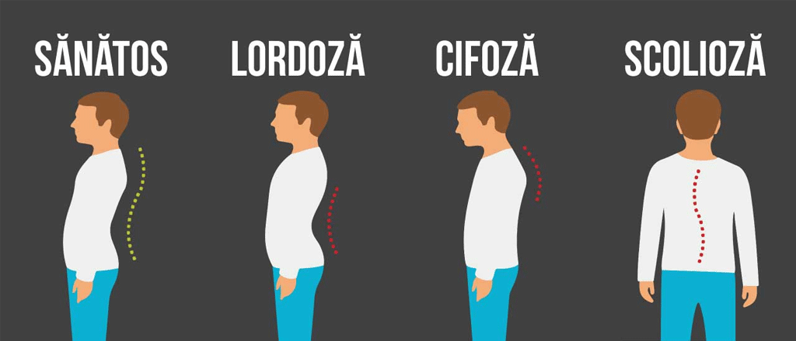

### Universitatea Titu Maiorescu 
#### Student anul II, Facultatea de Informatică ID

#### Numele: Dinu
#### Prenumele: Eugen Cosmin

#### Examen/evaluare anul 2 semestrul 1
#### Disciplina : Educație fizică

# Exerciţii pentru întreţinerea corectă a coloanei vertebrale

### Rolul coloanei vertebrale

Starea generală de sănătate depinde mult de funcția normală a coloanei
vertebrale. Pe lângă protejarea măduvei spinării, coloana vertebrală
îndeplinește alte două roluri majore în echilibrul și mobilitatea corporală,
fapt ce-i conferă o importanță deosebită în funcționarea aparatului locomotor:
**_funcția statică, de susținere a corpului și a segmentelor din partea superioară._**
și
**_funcția dinamică, de asigurare a mobilității trunchiului, capului și gâtului._**

### Curburile fiziologice ale coloanei vertebrale

Coloana vertebrală are traiect sinuos, datorită curburilor sale naturale în plan
antero-posterior, ce îi conferă echilibru în raport cu oasele bazinului. Aspectul
de resort spiralat îi asigură deasemenea și rezistență sporită la diferite
încărcături sau șocuri exercitate în plan vertical. În partea cervicală și
lombară curbura este îndreptată anterior (lordoza), iar în zona toracală este
îndreptată posterior (cifoza).

Corpul uman, în poziție ortostatică, are predispoziția de înclinare spre
înainte. Sub influența forței gravitaționale, curburile fiziologice ale coloanei
au tendința de a se accentua. Însă corpul rămâne în echilibru și curburile își
păstrează forma și mărimea grație jocului și tonicității musculare, a
elasticității ligamentelor și discurilor intervertebrale, precum și datorită
îmbinării anatomice a celor 24 de vertebre.

### Deviațiile coloanei vertebrale

Atitudinea coloanei vertebrale este foarte mult influențată de vârsta, sexul,
profesia și starea de oboseală a subiectului.

Deviațiile sunt numeroase:

 - Predispozitante (tipul morfologic, sexul, imaturitatea)
 - Favorizante (condițiile de viață și muncă, defectele de auz, văz, boli cronice,
intervenții chirurgicale, etc.)
 - Determinante (malformații congenitale, traumatisme, boli)

iar în plan anterio-posterior pot fi de tip:

- Cifotic
- Lordotic
- Cifo-lordotic
- Scoliotic (în plan lateral)

### Consecințele unei posturi viciate
Încă din tinerețe trebuie să fim atenți la starea coloanei vertebrale pentru a
ne păstra sănătatea pe parcursul vieții. O postură corporală neglijentă, o
poziție prea aplecată, prea laxă sau torsionată, nefirească, forțează mușchii și
ligamentele să mențină corpul în echilbru. Acest fapt poate genera oboseală,
dureri de spate, ale mușchilor, mâinilor sau picioarelor, dureri de cap,
amețeli, dereglarea somnului, anxietate, scăderea memoriei și a concentrării,
irascibilitate, dereglarea circulației periferice, deformarea coloanei
vertebrale. Dacă nu se iau măsuri, cu vârsta, starea sănătății se deteriorează:
apar schimbări degenerativo-distrofice mai profunde în scheletul osos, în
sistemul cardiovascular, respirator, endocrin, în sistemul central nervos și cel
vegetativ, în organele interne. Încep să apară diferite afecțiuni și pe plan
fizic și pe plan psihic, se creează blocaje energetice și dereglări iremediabile
în funcționarea organismului.

### Controlul și menținerea poziției corecte în ortostatism

- Atunci când stai în picioare, nu uita:
- Întinde spatele.
- Scoate pieptul înainte.
- Du umerii înapoi, relaxați.â
- Întărește abdomenul și fesele.
- Menține picioarele în poziție paralelă.
- Distribuie egal greutatea corpului pe ambele picioare.
- Asigură-te că genunchii sunt relaxați, nu blocați.
- Menține capul drept, cu privirea înainte.

### Testul peretelui

Pentru a-ți testa postura în poziția stând, îți recomandăm acest exercițiu:
lipește-te cu spatele de un perete astfel încât să simți cum capul, umerii și
fesele ating zidul. Călcâiele să rămână la o distanță de 5-10 cm de baza
peretelui. Introdu o mână, cu palma către perete în spațiul gol care corespunde
curburii lombare. În mod ideal, trebuie să simți grosimea mâinii în spațiul
dintre perete și spate. Dacă este prea mult spațiu, întărește mușchii abdominali
pentru a aplatiza curbura lombară. Dacă spațiul este prea mic, arcuiește
spatele, astfel încât mâna să aibă un spațiu confortabil între tine și perete.
Îndepărtează-te de perete și încearcă să menții aceeași postură chiar și în
timpul activităților zilnice.

### Controlul și menținerea poziției corecte în șezut

- Atunci când stai jos, nu uita:
- Alege un scaun care îți permite să păstrezi ambele picioare pe podea, în timp ce genunchii rămân la același nivel cu șoldurile; dacă este necesar, sprijină picioarele pe un suport sau podium.
- Ține spatele sprijinit de speteaza scaunului; la nevoie, plasează o pernă mică sau un prosop rulat în curbura inferioară a spatelui.
- Întinde vârful capului către tavan și trage bărbia înapoi ușor.
- Păstrează spatele și gâtul drepte, într-o manieră confortabilă.
- Menține umerii relaxați și drepți – nu ridicați, arcuiți înainte sau împinși spre înapoi.

### Antrenarea posturii corecte

Deși adoptarea unei poziții corporale corecte ar trebui să fie foarte naturală,
la început te poți simți rigid și înțepenit, dacă ai uitat senzația de “a sta
drept”. Cheia este antrenarea unei posturi corecte tot timpul. Poți face
progrese la orice vârstă. Masajul terapeutic, gimnastica de întindere și
exercițiile de tonifiere sunt metode perfecte pentru remedierea viciilor
posturale și menținerea sănătății coloanei vertebrale.

